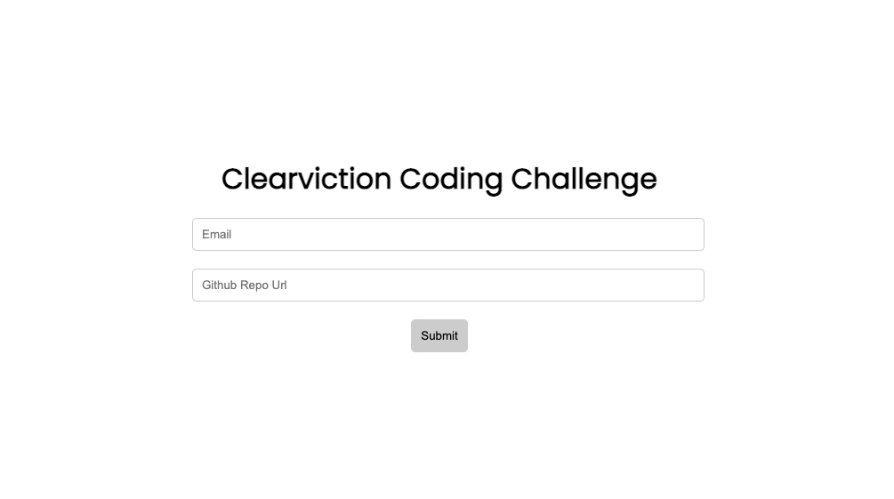
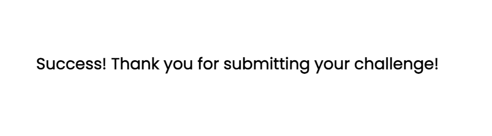

# Clearviction Coding Challenge

## **How To Install**

Setup requirements:
`Node.js`

1. `Fork` and `Clone` this respository to your local machine
2. Run `npm install` to install dependencies.
3. Run `npm run dev` or `npm start` to start server.
4. Open `http://localhost:3000` the web browser.

# **Preview Screen**

## Start Screen

## Success Message

